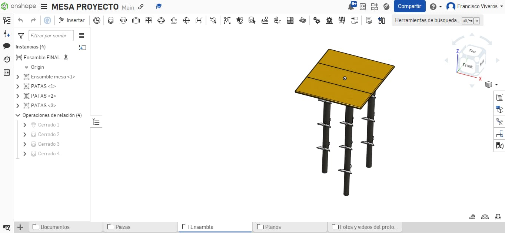

# 🪑 Portable Desk for Low-Resource Schools

This project was developed as part of my **International Baccalaureate (IB) Certification**, with a strong focus on **social impact through engineering design**.

The goal was to create a **functional, low-cost, and ergonomic portable desk** for students in underserved educational environments. Designed entirely in **Onshape**, this desk is optimized for ease of assembly, affordability, and durability.

---

## 📌 Project Overview

- 🎯 **Objective**: Design a portable, low-cost school desk to support students in low-resource areas.
- 🛠️ **Software**: Onshape (cloud-based parametric CAD)
- 🧠 **Skills applied**: 3D modeling, design for manufacturing, ergonomics, documentation
- 🧾 **Output**: Full CAD assembly, parts, and printable drawings

---

## 🧩 Features

- ✅ Compact and foldable structure
- ✅ Designed with accessible materials like plywood or MDF
- ✅ Lightweight for easy transportation
- ✅ Cost-effective and easy to manufacture
- ✅ Scalable for community deployment

---

## 🔗 Onshape Project Link

You can explore the full interactive CAD model and assembly here:  
[Portable Desk on Onshape](https://cad.onshape.com/documents/b50533277b3a9b13a73988bd/w/06cc6a27b0be7bdd32ebd9c1/e/bdad27d35cb4aaf410c7323d?renderMode=0&uiState=6877fc79cc95e74f1a510d2d)  

---

## 📂 Files Included

| File/Folder         | Description                                 |
|---------------------|---------------------------------------------|
| `desk_assembly.stl` | Full CAD assembly of the desk (3D model)    |
| `parts/`            | Individual part files exported from Onshape |
| `desk_layout.pdf`   | Printable 2D technical drawing               |
| `preview.png`       | Render or screenshot of the final design     |

---

## 📷 Preview

---

## 🧪 Use Case

This design was created to demonstrate how **engineering can empower education**. By combining CAD tools with a real-world social need, this project aimed to bring **practical, tangible support to students** in communities where classroom infrastructure is limited or nonexistent.

---

## 📜 Licensing

This project is shared for educational purposes. Please credit appropriately if reused or modified.

---

## 🤝 Let's Connect

Feel free to explore, comment, or contribute!  
If you have ideas for improving or manufacturing this design at scale, I'm open to collaboration.

[📫 LinkedIn](https://www.linkedin.com/in/francisco-viveros-mendoza-a20a06328)

---

**Designed and prototyped with impact in mind.**  
*Education is a right, not a privilege.*
